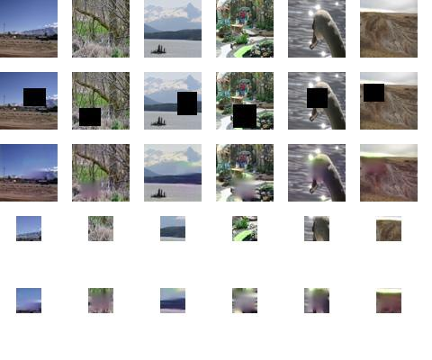

# GANscape
**Image inpainting** tool specialised for **landscape** pictures, utilizing the power of **deep learning** and **generative adversarial networks**. Developed for Deep Learning in Practice at **Budapest University of Technology and Economics** in Autumn 2020.

**Documentation**: coming soon

## Authors
- Richárd Kovács (@Ricsard13)
- Mátyás Dulácska (@dulacskamty)
- Krisztián Peőcz (@pkrisz99)

## Steps for compiling the dataset
- We downloaded the **Places365-Standard** 256x256 train database from http://places2.csail.mit.edu/download.html
- Out of the about 1.8 million images, 244k were from categories, that we considered potentially useful.
- The YOLOv3 neural network was used to exclude images that contained people. We did this by distributing files into smaller folders, so that can be run on Colaboratory, but we used our CPU's as well. A batch of 10k images took about 4 hours to process.
- This left us with 203k good images, which we separated into train, test, and validation datasets.
- We used a 5% testing and a 10% validation split.
- An other script was used to cut out parts of the images. The original images, the cut out parts and the modified images were all saved, along with the coordinates of the cut out parts.
- Finally this left us with 3x203k images, with a total size of 5.4 gigabytes.

### Reducing image dimension to optimize for computation time
- While the 256x256 image size creates a nice balance between image quality and computational requirements, we moved down to 64x64 to speed up computing on our limited resources.
- We varied the crop size from 20x20 to 25x25, which means that 10 to 15% of the area of the picure will be cropped.
- Around these crops we define a unifrom 28x28 rectangle. This was important, because one of the network's inputs is the cropped part, and we need an input that has the same dimensions.
- Both the test and the validation spilt stayed the same.
- So this left us with 3x203k images, with a total size of 807 megabytes.

### Links for the dataset

**Disclaimer**: We do not intend to distribute this database, we are only providing these for educational evaluation purposes.

Link for the data with the 64x64 pictures that have 28x28 cropped parts:
https://drive.google.com/file/d/1N9R-XnwEJuN2W6rURWloKTZdHW1UQcku/view?usp=sharing

### DataLoading class
In order to make the loading of the pictures straightforward, we made an individual class for this purpose. The DataRead class stores the required data for the training. You can find further information in the manuals folder.

## Constructing the network
- While constructing the network we relied heavily on the article: http://iizuka.cs.tsukuba.ac.jp/projects/completion/data/completion_sig2017.pdf as well as on the implementation based on this article: https://github.com/V1NAY8/glcic
- Our network uses a GAN structure as it has a generator and a discriminator part.
- The generator gets the cropped image and tries to guess the missing part of the picture.
- The discriminator receives the generated picture and also the part that had to be to generated - in our network this is 64x64 picture and a 28x28 cropped part. With the given inputs the discriminator tries to determine whether the picture was generated (tampered with) or not.
- The training of the network consists of three parts. Firstly, we train the generator with MSE loss, then we train the discriminator separately (with both generated and original pictures) using binary crossentropy loss, and finally we train the generator and discriminator together with the discriminator's weights locked and using a joint loss, so that the generator is able to fool the discriminator.
- Scripts related to handling the network (create, train, test, help functions etc.) are in `network_build_run.ipynb`, and we have ran them on Google Colaboratory.

## Network customization and hyperparameter optimalization
The network provides many possibilities for customization.
- generatorDescriber: dict containing the parameters of the generator network
- discriminatorDescriber: dict containing the parameters of the discriminator network 
- earlyStopPhases: provides skip conditions if the loss remains too high on phase 2 or phase 3
- optimizers: optimizer algorithms for the different networks
- weightForJointLoss: weights of the mse and adversarial loss for the joint loss
- ratios: how steps are divided between phases
These can be found in `network.ipynb`.

## Results
We defined the base network with the following parameters:
- Phases: 0.33-0.33-0.34
- MSE:ADV ratio: 1:1
- Batch size: 128
- Discriminator global average pooling: false
- Generator bottleneck: 4
Then we deviated from this by changing one parameter. We ran the training for 10 epochs and compared the results on a scale of 1 to 10:

|    Hyperparameter   | Local score | Global score |   Average   |
|:-------------------:|:-----------:|:------------:|:-----------:|
|   Original network  |     3.67    |     5.33     |     4.50    |
| Phases: 0.2-0.5-0.3 |     3.67    |     6.00     |     4.83    |
| Phases: 0.2-0.3-0.5 |     3.00    |     4.33     |     3.67    |
|     MSE:ADV=10:1    |     4.67    |     6.33     |     5.50    |
|    MSE:ADV=100:1    |     3.66    |     4.33     |     4.00    |
|   Batch size: 256   |     3.67    |     5.33     |     4.50    |
|   Global avg pool   |     2.67    |     3.33     |     3.00    |
|    Bottleneck: 3    |     3.67    |     4.33     |     4.00    |

### Example picture
Letting a well configured network train for 6 hours yielded the following result:

## References
** Original dataset: **  
A 10 million Image Database for Scene Recognition
B. Zhou, A. Lapedriza, A. Khosla, A. Oliva, and A. Torralba
IEEE Transactions on Pattern Analysis and Machine Intelligence, 2017

** Original network implementation: **  
Globally and Locally Consistent Image Completion
P. Sai Vinay
https://github.com/V1NAY8/glcic

More references can be found in the documentation.